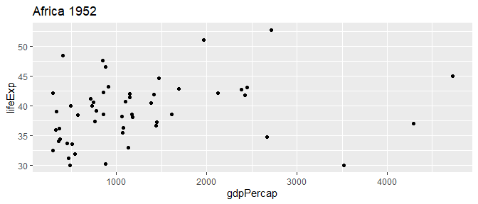
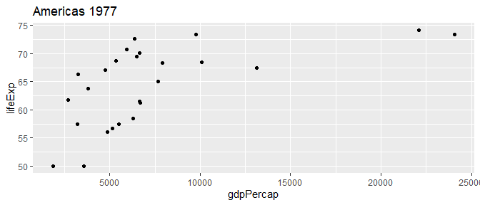
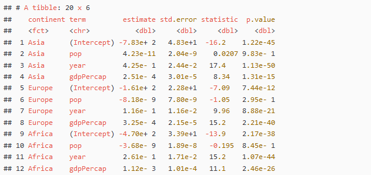

Untitled
================
DanielH
08/11/2019

``` r
# load packages
library(pacman)

p_load(tidyverse, tidymodels, janitor, MASS, ISLR, GGally, ggcorrplot, boot, skimr, corrr,
       glue, repurrrsive, patchwork, broom, ggthemes, knitr, scales, gapminder)
```

-----

<http://www.rebeccabarter.com/blog/2019-08-19_purrr/#advanced-exercise>

> `map(.x, .f)` with `.x` being the data object we want to map over and
> `.f` being the function to iteretively aplly to each element of the
> data object

The input `.x` object can be:

1.  a *vector* (of any type), in which case the iteration is done over
    the entries of the vector

2.  a *list*, in which case the iteration is performed over the elements
    of the list

3.  a *data frame*, in which case the iteration is performed over the
    columns of the data frame (which, since a data frame is a special
    kind of list, is technically the same as the previous point).

### looping with map()

``` r
# define function .f
addTen <- 
  function(.x){
    return(.x + 10)
  }

# call function .f on data object .x, a vector
.f <- addTen
x <- c(1, 4, 7)

map(x, .f)
```

    ## [[1]]
    ## [1] 11
    ## 
    ## [[2]]
    ## [1] 14
    ## 
    ## [[3]]
    ## [1] 17

``` r
# if x is a dataframe-tibble
x <- c(1, 4, 7) %>% as_tibble()
```

    ## Warning: Calling `as_tibble()` on a vector is discouraged, because the behavior is likely to change in the future. Use `tibble::enframe(name = NULL)` instead.
    ## This warning is displayed once per session.

``` r
map(x, .f)
```

    ## $value
    ## [1] 11 14 17

``` r
# if x is a list
x <- list(c(1, 4, 7))

map(x, .f)
```

    ## [[1]]
    ## [1] 11 14 17

As we can see if we have a vector/tibble/list input map() always returns
a list

On the contrary, modify() always returns an output the same type as the
input

``` r
# call function .f on data object .x, 
.f <- addTen
x <- c(1, 4, 7)

# if x is a vector
modify(x, .f) 
```

    ## [1] 11 14 17

``` r
modify(x, .f) %>% class()
```

    ## [1] "numeric"

``` r
# if x is a dataframe-tibble
modify(tibble(x), .f) 
```

    ## # A tibble: 3 x 1
    ##       x
    ##   <dbl>
    ## 1    11
    ## 2    14
    ## 3    17

``` r
modify(tibble(x), .f) %>% class()
```

    ## [1] "tbl_df"     "tbl"        "data.frame"

``` r
# if x is a list
modify(list(1, 4, 7), .f)
```

    ## [[1]]
    ## [1] 11
    ## 
    ## [[2]]
    ## [1] 14
    ## 
    ## [[3]]
    ## [1] 17

``` r
modify(list(1, 4, 7), .f) %>% class()
```

    ## [1] "list"

There are also scoped versions of modify, for example `modify_if()` that
only applies the function to elements that satisfy a specific criteria
(specified by a “predicate function”, the second argument called `.p`).

For instance, the following example only modifies the third entry since
it is greater than 5.

``` r
x <- c(1,4,7)

x %>% map_if(.,               # data to iterate over
             .p = ~(.x) > 5,  # predicate function, the condition to be met
             .f = addTen      # function to apply
             )
```

    ## [[1]]
    ## [1] 1
    ## 
    ## [[2]]
    ## [1] 4
    ## 
    ## [[3]]
    ## [1] 17

previously we used the tilde-dot notation, we can now use it in another
example

``` r
map_dbl(c(1, 4, 7),  # data to iterate over
        ~{.x + 10})  # function to apply
```

    ## [1] 11 14 17

## example

It can be a good idea to load the original data and save it as an object
with a meaningful name and an *orig* suffix.

We then define a copy of the original dataset without the \_orig suffix.
Having an original copy of the data in the current environment means
that it is easy to check that our manipulations do what we expected.

We will make direct data cleaning modifications to the `gapminder` data
frame, but will never edit the `gapminder_orig` data frame.

``` r
gapminder_orig <- 
  read.csv("https://raw.githubusercontent.com/swcarpentry/r-novice-gapminder/gh-pages/_episodes_rmd/data/gapminder-FiveYearData.csv")

# define a copy of the original dataset that we will clean and play with 
gapminder <- 
  gapminder_orig %>%
  as_tibble()
```

Since gapminder is a data frame, the `map()` functions will iterate over
each column.

An example of simple usage of the `map()` functions is to summarize each
column. For instance, you can identify the type of each column by
applying the class() function to each column

``` r
gapminder %>%
  map_chr(class)
```

    ##   country      year       pop continent   lifeExp gdpPercap 
    ##  "factor" "integer" "numeric"  "factor" "numeric" "numeric"

Similarly, if we wanted to identify the number of distinct values in
each column, we could apply the `n_distinct()`

``` r
gapminder %>%
  map_int(n_distinct)
```

    ##   country      year       pop continent   lifeExp gdpPercap 
    ##       142        12      1704         5      1626      1704

If we want to do something a little more complicated, such return a few
different summaries of each column in a data frame, you can use
`map_df()`.

When things are getting a little bit more complicated, we typically need
to define an anonymous function that you want to apply to each column

we want to calculate the number of distinct entries and the type of the
current column (which is accessible as `.x`), and then combine them into
a two-column data frame.

``` r
gapminder %>%
  map_df(~(tibble(n_distinct = n_distinct(.x),
                  class = class(.x))))
```

    ## # A tibble: 6 x 2
    ##   n_distinct class  
    ##        <int> <chr>  
    ## 1        142 factor 
    ## 2         12 integer
    ## 3       1704 numeric
    ## 4          5 factor 
    ## 5       1626 numeric
    ## 6       1704 numeric

As we can see we’ve lost the variable names\!

To keep them we have to do tell `map_df()` to include them using the
`.id` argument of `map_df()`

``` r
gapminder %>%
  map_df(~(tibble(n_distinct = n_distinct(.x),
                  class = class(.x))),
         .id = "variable")
```

    ## # A tibble: 6 x 3
    ##   variable  n_distinct class  
    ##   <chr>          <int> <chr>  
    ## 1 country          142 factor 
    ## 2 year              12 integer
    ## 3 pop             1704 numeric
    ## 4 continent          5 factor 
    ## 5 lifeExp         1626 numeric
    ## 6 gdpPercap       1704 numeric

### maps with multiple input objects `map2()`

``` r
map2(.x = object1, # the first object to iterate over
     .y = object2, # the second object to iterate over
     .f = plotFunction(.x, .y))
```

``` r
continent_year <- gapminder %>% distinct(continent, year)
continent_year %>%
  head(5)
```

    ## # A tibble: 5 x 2
    ##   continent  year
    ##   <fct>     <int>
    ## 1 Asia       1952
    ## 2 Asia       1957
    ## 3 Asia       1962
    ## 4 Asia       1967
    ## 5 Asia       1972

we then extract the continent and year pairs as separate vectors

``` r
# extract the continent and year pairs as separate vectors
continents <- continent_year %>% pull(continent) %>% as.character()
years <- continent_year %>% pull(year)
```

Now we can write a function that …

``` r
plot_list <- 
  map2(.x = continents,   # the first object to iterate over
       .y = years,          # the second object to iterate over
       .f = ~{gapminder %>%   # the function to apply
                filter(continent == .x,
                       year == .y) %>%
                ggplot() +
                geom_point(aes(x = gdpPercap, y = lifeExp)) +
                 ggtitle(glue(.x, " ", .y))})   
```

We can randomly extract a couple of elements of the plot\_list object.
For example, we can extract element

``` r
# randomly select two elements
set.seed(2019)
sample(60, 2)
```

    ## [1] 25 42

``` r
# extract the tow random elements
plot_list %>%
  pluck(25)
```

<!-- -->

``` r
plot_list %>%
  pluck(42)
```

<!-- -->

### list-columns and nested dataframes

a tibble can be “nested” where the tibble is essentially split into
separate data frames based on a grouping variable, and these separate
data frames are stored as entries of a list (that is then stored in the
data column of the data frame)

For example, we nest the gapminder data by continent.

``` r
# nested dataframe
gapminder_nested <-
  gapminder %>%
  group_by(continent) %>%
  nest()

# check one element
gapminder_nested %>% 
  pull(data) %>%  # extract the data list 
  pluck(5) %>%  # extract the first entry from the data column, Oceania (5)
  sample_n(5)
```

    ## # A tibble: 5 x 5
    ##   country      year      pop lifeExp gdpPercap
    ##   <fct>       <int>    <dbl>   <dbl>     <dbl>
    ## 1 Australia    1972 13177000    71.9    16789.
    ## 2 New Zealand  1952  1994794    69.4    10557.
    ## 3 New Zealand  1972  2929100    71.9    16046.
    ## 4 Australia    2007 20434176    81.2    34435.
    ## 5 New Zealand  1982  3210650    73.8    17632.

``` r
# another way to do it, this time Asia (1)
gapminder_nested %>%
  pluck("data", 1) %>%
  sample_n(5)
```

    ## # A tibble: 5 x 5
    ##   country      year      pop lifeExp gdpPercap
    ##   <fct>       <int>    <dbl>   <dbl>     <dbl>
    ## 1 Philippines  1977 46850962    60.1     2373.
    ## 2 Yemen Rep.   1992 13367997    55.6     1879.
    ## 3 Korea Rep.   1977 36436000    64.8     4657.
    ## 4 Vietnam      1992 69940728    67.7      989.
    ## 5 Syria        1967  5680812    53.7     1882.

``` r
gapminder_nested %>%
  view()
```

#### nesting the gapminder data

Let’s say want to calculate the average life expectancy within each
continent and add it as a new column using `mutate()`

``` r
gapminder_nested %>%
  mutate(avg_lifeExp = map_dbl(data, ~(mean(.x$lifeExp)))) %>%
  mutate_at(3, round, 1)
```

    ## # A tibble: 5 x 3
    ## # Groups:   continent [5]
    ##   continent           data avg_lifeExp
    ##   <fct>     <list<df[,5]>>       <dbl>
    ## 1 Asia           [396 x 5]        60.1
    ## 2 Europe         [360 x 5]        71.9
    ## 3 Africa         [624 x 5]        48.9
    ## 4 Americas       [300 x 5]        64.7
    ## 5 Oceania         [24 x 5]        74.3

This code

1.  iterates through the data frames stored in the data column (one for
    each continent)

2.  returns the average life expectancy for each data frame (continent)

3.  concatonates the results into a numeric vector (which is then stored
    as a column called `avg_lifeExp`).

#### fitting a model for each continent and evaluating it

The next exampe will demonstrate how to fit a model separately for each
continent, and evaluate it, all within a single tibble.

``` r
gapminder_nested <-
  gapminder_nested %>%
  mutate(lm_object = map(data, ~lm(lifeExp ~ pop + gdpPercap + year, data = .x)))
```

Let’s take a look at the first linear model (for Asia)

``` r
gapminder_nested %>%
  pluck("lm_object", 1)
```

    ## 
    ## Call:
    ## lm(formula = lifeExp ~ pop + gdpPercap + year, data = .x)
    ## 
    ## Coefficients:
    ## (Intercept)          pop    gdpPercap         year  
    ##  -7.833e+02    4.228e-11    2.510e-04    4.251e-01

We can now predict the response for the data stored in the data column
using the corresponding linear model.

So we now have two objects I want to iterate over: the data and the
linear model object. This means we want to use`map2()`.

When things get a little more complicated we’re better off using a full
anonymous function rather than the tilde-dot shorthand.

``` r
# predict the response for each continent
gapminder_nested <- 
  gapminder_nested %>% 
  mutate(pred = map2(lm_object, data, 
                     function(.lm, .data) predict(.lm, .data)))

gapminder_nested
```

    ## # A tibble: 5 x 4
    ## # Groups:   continent [5]
    ##   continent           data lm_object pred       
    ##   <fct>     <list<df[,5]>> <list>    <list>     
    ## 1 Asia           [396 x 5] <lm>      <dbl [396]>
    ## 2 Europe         [360 x 5] <lm>      <dbl [360]>
    ## 3 Africa         [624 x 5] <lm>      <dbl [624]>
    ## 4 Americas       [300 x 5] <lm>      <dbl [300]>
    ## 5 Oceania         [24 x 5] <lm>      <dbl [24]>

We can then calculate the correlation between the predicted response and
the true response, this time using the `map2()_dbl` function since we
want the output the be a numeric vector rather than a list of single
elements.

``` r
gapminder_nested %>%
  mutate(corr = map2_dbl(pred, data,  
                         function(.pred, .data) cor(.pred, .data$lifeExp)))
```

    ## # A tibble: 5 x 5
    ## # Groups:   continent [5]
    ##   continent           data lm_object pred         corr
    ##   <fct>     <list<df[,5]>> <list>    <list>      <dbl>
    ## 1 Asia           [396 x 5] <lm>      <dbl [396]> 0.723
    ## 2 Europe         [360 x 5] <lm>      <dbl [360]> 0.834
    ## 3 Africa         [624 x 5] <lm>      <dbl [624]> 0.645
    ## 4 Americas       [300 x 5] <lm>      <dbl [300]> 0.779
    ## 5 Oceania         [24 x 5] <lm>      <dbl [24]>  0.987

### advanced example

The goal of this exercise is to fit a separate linear model for each
continent without splitting up the data.

Create the following data frame that has the continent, each term in the
model for the continent, its linear model coefficient estimate, and
standard error.



``` r
gapminder %>%
  group_by(continent) %>%
  nest() %>%
  mutate(lm_object = map(data, 
                         ~lm(lifeExp ~ pop + gdpPercap + year, data = .x)),
         tidy_lm = map(lm_object, tidy)) %>%
  unnest(tidy_lm) %>%
  dplyr::select(-c(2,3)) %>%
  kable()
```

| continent | term        |      estimate |  std.error |    statistic |   p.value |
| :-------- | :---------- | ------------: | ---------: | -----------: | --------: |
| Asia      | (Intercept) | \-783.3346343 | 48.2915943 | \-16.2209313 | 0.0000000 |
| Asia      | pop         |     0.0000000 |  0.0000000 |    0.0207413 | 0.9834626 |
| Asia      | gdpPercap   |     0.0002510 |  0.0000301 |    8.3360158 | 0.0000000 |
| Asia      | year        |     0.4250632 |  0.0244239 |   17.4035758 | 0.0000000 |
| Europe    | (Intercept) | \-161.3479493 | 22.7695391 |  \-7.0861315 | 0.0000000 |
| Europe    | pop         |     0.0000000 |  0.0000000 |  \-1.0495909 | 0.2946182 |
| Europe    | gdpPercap   |     0.0003255 |  0.0000215 |   15.1544218 | 0.0000000 |
| Europe    | year        |     0.1155254 |  0.0115983 |    9.9605593 | 0.0000000 |
| Africa    | (Intercept) | \-470.2809149 | 33.8550528 | \-13.8910111 | 0.0000000 |
| Africa    | pop         |     0.0000000 |  0.0000000 |  \-0.1949940 | 0.8454615 |
| Africa    | gdpPercap   |     0.0011215 |  0.0001008 |   11.1242138 | 0.0000000 |
| Africa    | year        |     0.2610369 |  0.0171472 |   15.2233034 | 0.0000000 |
| Americas  | (Intercept) | \-533.3126441 | 40.9846244 | \-13.0125054 | 0.0000000 |
| Americas  | pop         |     0.0000000 |  0.0000000 |  \-2.4942117 | 0.0131691 |
| Americas  | gdpPercap   |     0.0006752 |  0.0000715 |    9.4437187 | 0.0000000 |
| Americas  | year        |     0.2999141 |  0.0207684 |   14.4408598 | 0.0000000 |
| Oceania   | (Intercept) | \-209.7021148 | 51.1899264 |  \-4.0965504 | 0.0005613 |
| Oceania   | pop         |     0.0000000 |  0.0000000 |    0.2508021 | 0.8045257 |
| Oceania   | gdpPercap   |     0.0002027 |  0.0000847 |    2.3945085 | 0.0265540 |
| Oceania   | year        |     0.1415402 |  0.0265218 |    5.3367427 | 0.0000319 |

#### additional purrr functionalities for lists

To demonstrate how to use purrr to manipulate lists, we will split the
gapminder dataset into a list of data frames (which is kind of like the
converse of a data frame containing a list-column). To make sure it’s
easy to follow, we will only keep 5 rows from each continent.

``` r
set.seed(23489)
gapminder_list <-
  gapminder %>%
  split(.$continent) %>%
  modify_depth(1, sample_n, 5)
```

##### `keep()`/`discard()`

these are like `select_if` but for lists not dataframes.

For example, the following code only keeps the gapminder continent data
frames (the elements of the list) that have an average (among the sample
of 5 rows) life expectancy of at least 70.

``` r
gapminder_list %>%
  keep(~{mean(.x$lifeExp) > 70})
```

    ## $Americas
    ## # A tibble: 5 x 6
    ##   country             year     pop continent lifeExp gdpPercap
    ##   <fct>              <int>   <dbl> <fct>       <dbl>     <dbl>
    ## 1 Dominican Republic  1997 7992357 Americas     70.0     3614.
    ## 2 Puerto Rico         1987 3444468 Americas     74.6    12281.
    ## 3 Honduras            1992 5077347 Americas     66.4     3082.
    ## 4 Uruguay             2007 3447496 Americas     76.4    10611.
    ## 5 Costa Rica          1962 1345187 Americas     62.8     3461.
    ## 
    ## $Europe
    ## # A tibble: 5 x 6
    ##   country         year      pop continent lifeExp gdpPercap
    ##   <fct>          <int>    <dbl> <fct>       <dbl>     <dbl>
    ## 1 United Kingdom  2002 59912431 Europe       78.5    29479.
    ## 2 Greece          1997 10502372 Europe       77.9    18748.
    ## 3 Belgium         2002 10311970 Europe       78.3    30486.
    ## 4 Croatia         2002  4481020 Europe       74.9    11628.
    ## 5 Netherlands     1967 12596822 Europe       73.8    15363.
    ## 
    ## $Oceania
    ## # A tibble: 5 x 6
    ##   country      year      pop continent lifeExp gdpPercap
    ##   <fct>       <int>    <dbl> <fct>       <dbl>     <dbl>
    ## 1 Australia    1982 15184200 Oceania      74.7    19477.
    ## 2 New Zealand  1997  3676187 Oceania      77.6    21050.
    ## 3 New Zealand  2007  4115771 Oceania      80.2    25185.
    ## 4 Australia    2007 20434176 Oceania      81.2    34435.
    ## 5 New Zealand  1952  1994794 Oceania      69.4    10557.

`discard()` does the opposite of `keep()`: it discards any elements that
satisfy your logical condition.

##### `reduce()`

`reduce()` is designed to combine (reduces) all of the elements of a
list into a single object by iteratively applying a binary function (a
function that takes two inputs).

For instance, applying a reduce function to add up all of the elements
of the vector `c(1, 2, 3)` is like doing `sum(sum(1, 2), 3)`: first it
applies sum to 1 and 2, then it applies sum again to the output of
sum(1, 2) and 3

``` r
c(1, 2, 3) %>%
  reduce(sum)
```

    ## [1] 6

if we want to keep intermediate results, we can use `accumulate()`

``` r
c(1, 2, 3) %>%
  accumulate(sum)
```

    ## [1] 1 3 6

An example of when `reduce()` might come in handy is when you want to
perform many `left_join()`s in a row, or to do repeated `rbinds()`
(e.g. to bind the rows of the list back together into a single data
frame)

``` r
gapminder_list %>%
  reduce(bind_rows)
```

    ## # A tibble: 25 x 6
    ##    country             year      pop continent lifeExp gdpPercap
    ##    <fct>              <int>    <dbl> <fct>       <dbl>     <dbl>
    ##  1 Gambia              1967   439593 Africa       35.9      735.
    ##  2 Sierra Leone        1967  2662190 Africa       34.1     1206.
    ##  3 Namibia             1997  1774766 Africa       58.9     3900.
    ##  4 Equatorial Guinea   1992   387838 Africa       47.5     1132.
    ##  5 Cote d'Ivoire       2002 16252726 Africa       46.8     1649.
    ##  6 Dominican Republic  1997  7992357 Americas     70.0     3614.
    ##  7 Puerto Rico         1987  3444468 Americas     74.6    12281.
    ##  8 Honduras            1992  5077347 Americas     66.4     3082.
    ##  9 Uruguay             2007  3447496 Americas     76.4    10611.
    ## 10 Costa Rica          1962  1345187 Americas     62.8     3461.
    ## # ... with 15 more rows

##### logical statements for lists

Asking logical questions of a list can be done using `every()` and
`some()`.

  - to ask whether every continent has average life expectancy greater
    than 70

  - to ask whether some continents have average life expectancy greater
    than 70, we use

<!-- end list -->

``` r
gapminder_list %>% 
  every(~{mean(.x$lifeExp) > 70})
```

    ## [1] FALSE

``` r
gapminder_list %>%
  some(~{mean(.x$lifeExp) > 70})
```

    ## [1] TRUE

`has_element()` can be viewed as an equivalent of`%in%` for lists

``` r
list(1, c(2, 5, 1), "a") %>%
  has_element("a")
```

    ## [1] TRUE
